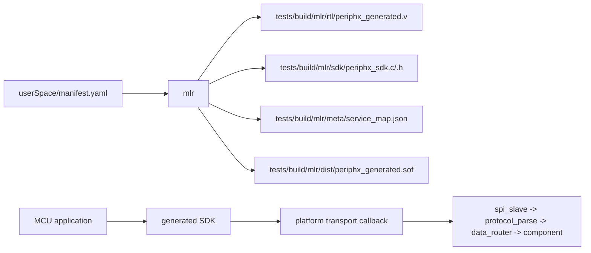

[简体中文](README_zh_CN.md) | [English](README.md)

# PeriphX

PeriphX is a configurable FPGA peripheral framework for MCU developers.

The current repository state already contains a working end-to-end baseline:

- MCU talks to the FPGA over SPI
- The FPGA parses fixed-size frames and routes requests to services
- `mlr` generates the RTL, SDK, service map, and Quartus project artifacts
- The `pwm_led` service is used as the current reference component

## Current Status

The current baseline is hardware-validated and should be treated as the
starting point for further development.

- SPI slave, frame parser, and router are implemented
- `pwm_led` is the reference service path
- The generated SDK is ready for MCU integration
- Generated artifacts are written under `tests/build/mlr`

What is still true:

- The framework is not feature-complete
- The generator currently supports the `pwm_led` component as the reference
  implementation
- Service IDs are assigned in manifest order during the build

## Repository Layout

- `components/core/`
  - Core RTL blocks: `spi_slave`, `protocol_parse`, `data_router`
- `components/pwm_led/`
  - Reference component used for end-to-end bring-up
- `userSpace/manifest.yaml`
  - Source of truth for the current build
- `mlr/`
  - Python generator that reads the manifest and emits RTL / SDK / Quartus
    inputs
- `tests/build/mlr/`
  - Generated artifacts; this is the output directory for the current build
- `docs/frame_format.txt`
  - Canonical frame-format note for the current protocol contract

## Build Flow



The `manifest.yaml` file defines the components for a given build. `mlr`
turns that into:

- FPGA RTL
- MCU SDK headers and source
- Service ID mapping metadata
- Quartus project input and bitstream

## Current Wire Protocol

The current frame format is fixed at 6 bytes:

```text
byte0: server_id
byte1: payload[31:24]
byte2: payload[23:16]
byte3: payload[15:8]
byte4: payload[7:0]
byte5: {crc4[7:4], msg_type[3:0]}
```

Message types:

- `0x0` request
- `0x1` response
- `0x2` event
- `0x3` error

CRC:

- CRC4 uses polynomial `x^4 + x + 1`
- MSB-first
- Seed is `0`

The current bring-up SDK keeps a short alignment window between the request
and the readback half of a single SPI transaction so the response lands on a
stable byte boundary.

For the canonical format note, see [`docs/frame_format.txt`](docs/frame_format.txt).

## MCU Integration

The generated SDK is platform-agnostic. MCU developers provide a transport
callback and a user-context pointer.

```c
typedef int (*periphx_transport_fn)(
    void *user,
    const uint8_t *tx,
    uint8_t *rx,
    size_t len
);

typedef struct {
    periphx_transport_fn transfer;
    void *user;
} periphx_device_t;
```

`user` is an opaque pointer that the SDK passes back to your transport
function. It is typically used to store platform-specific state such as:

- SPI peripheral handle
- CS pin information
- DMA or lock state
- any other transport metadata

Minimal usage pattern:

```c
periphx_device_t dev;
periphx_device_init(&dev, my_transport, &my_context);

uint32_t response = 0;
periphx_pwm_led1_set_sys_cnt_prds(&dev, 50000000u, &response);
periphx_pwm_led1_set_sys_cnt_duty(&dev, 25000000u, &response);
```

The generated SDK exposes:

- Generic helpers such as `periphx_transfer_frame`
- Typed helpers such as `periphx_call_u32`
- Component-specific wrappers generated from `manifest.yaml`

## Build

From the repository root:

```powershell
python -m mlr build --generate-only
python -m mlr build
```

`--generate-only` writes the RTL, SDK, and service map without running
Quartus. `python -m mlr build` performs the full flow and copies the resulting
bitstream into:

- [`tests/build/mlr/dist/periphx_generated.sof`](tests/build/mlr/dist/periphx_generated.sof)

## Notes

- The current build is validated around the `pwm_led` reference path.
- If you change the order of components or services in `manifest.yaml`, the
  generated service IDs will change because IDs are assigned during the build.
- Generated files live under `tests/build/mlr`; do not edit them by hand.
- For day-to-day work, treat `userSpace/manifest.yaml` as the build input and
  `tests/build/mlr/` as disposable output.

## Contributing

Issues, ideas, and implementation help are welcome.

If you want to discuss the project, contact:

**[ghz2985715538@gmail.com](mailto:ghz2985715538@gmail.com)**
