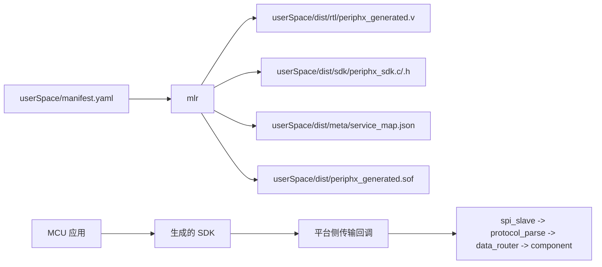

[简体中文](README_zh_CN.md) | [English](README.md)

# PeriphX

PeriphX 是面向 MCU 开发者的可配置 FPGA 外设框架。

当前仓库已经具备一条可工作的端到端基线，并已完成生成式 UART 组件验证：

- MCU 通过 SPI 与 FPGA 通信
- FPGA 解析固定长度帧并把请求路由到服务
- `mlr` 会生成 RTL、SDK、服务映射以及 Quartus 所需产物
- `pwm_led` 仍然是参考 bring-up 组件
- `uart` 已实现为支持运行时配置和固定 TX/RX FIFO 的 PeriphX 组件

## 当前状态

现在的代码基线已经在硬件上验证过，可以作为后续开发的起点。

- `spi_slave`、帧解析器和 router 已经实现
- `pwm_led` 是当前的参考服务路径
- `uart` 已接入 `mlr` 代码生成和 SDK 包装接口
- UART 支持 manifest 默认配置和 MCU 侧运行时配置
- UART 已通过 Verilator testbench、功能覆盖率和行覆盖率检查验证
- 生成的 SDK 已经可以给 MCU 端接入
- 所有生成物都放在 `userSpace/dist`

还需要说明的是：

- 这个框架还不是完整最终版
- 组件支持正在从 `pwm_led` 和 `uart` 继续扩展到更多常用外设
- 服务 ID 在构建时按 `manifest.yaml` 中的顺序分配

## 仓库结构

- `components/core/`
  - 核心 RTL：`spi_slave`、`protocol_parse`、`data_router`
- `components/pwm_led/`
  - 用于打通整条链路的参考组件
- `components/uart/`
  - 生成式 UART 组件，支持运行时配置、TX/RX FIFO、SDK 包装接口和 Verilator 测试
- `userSpace/manifest.yaml`
  - 当前构建的唯一输入源
- `mlr/`
  - Python 生成器，负责读取 manifest 并生成 RTL / SDK / Quartus 输入
- `userSpace/dist/`
  - 构建输出目录；这里面的内容都是生成物
- `docs/frame_format.txt`
  - 当前协议帧格式的说明

## 构建流程


```mermaid
flowchart LR
    M["userSpace/manifest.yaml"] --> G["mlr"]
    G --> RTL["userSpace/dist/rtl/periphx_generated.v"]
    G --> SDK["userSpace/dist/sdk/periphx_sdk.c/.h"]
    G --> MAP["userSpace/dist/meta/service_map.json"]
    G --> SOF["userSpace/dist/periphx_generated.sof"]
    MCU["MCU 应用"] --> SDK_USE["生成的 SDK"]
    SDK_USE --> TRANSPORT["平台侧传输回调"]
    TRANSPORT --> FPGA["spi_slave -> protocol_parse -> data_router -> component"]
```

`manifest.yaml` 定义当前这次构建需要哪些组件。`mlr` 会把它转换成：

- FPGA RTL
- MCU SDK 头文件和源码
- 服务 ID 映射元数据
- Quartus 工程输入和 bitstream

## MCU 接入方式

生成出来的 SDK 不绑定具体平台。MCU 开发者需要自己提供一个传输回调和一个上下文指针。

```c
typedef int (*periphx_transport_fn)(
    void *user,
    const uint8_t *tx,
    uint8_t *rx,
    size_t len
);

typedef struct {
    periphx_transport_fn transfer;
    void *user;
} periphx_device_t;
```

`user` 是一个不透明上下文指针，SDK 会在每次 SPI 传输时原样传回给你的回调函数。它通常用来保存：

- SPI 外设句柄
- CS 引脚信息
- DMA、锁或超时状态
- 其他传输相关数据

最小使用示例：

```c
periphx_device_t dev;
periphx_device_init(&dev, my_transport, &my_context);

uint32_t response = 0;
periphx_pwm_led1_set_sys_cnt_prds(&dev, 50000000u, &response);
periphx_pwm_led1_set_sys_cnt_duty(&dev, 25000000u, &response);
```

生成的 SDK 会提供：

- 通用接口，例如 `periphx_transfer_frame`
- 类型封装接口，例如 `periphx_call_u32`
- 根据 `manifest.yaml` 自动生成的组件级接口

对于 UART 实例，生成的 SDK 还会提供基于 `periphx_uart_config_t` 的结构体配置接口。MCU 代码可以直接配置波特率、数据位、校验位和停止位，不需要手动打包底层 payload。

## 构建

在仓库根目录运行：

```powershell
python -m mlr build --generate-only
python -m mlr build
```

`--generate-only` 只生成 RTL、SDK 和服务映射，不调用 Quartus。`python -m mlr build`
会执行完整流程，并把 bitstream 复制到：

- [`userSpace/dist/periphx_generated.sof`](userSpace/dist/periphx_generated.sof)

## 说明

- 当前基线已经围绕 `pwm_led` 参考路径和生成式 UART 组件路径验证。
- 如果你修改了 `manifest.yaml` 里组件或服务的顺序，重新生成后服务 ID 会变化，
  因为 ID 是构建时分配的。
- 所有生成文件都放在 `userSpace/dist`，不要手改。
- 日常开发时，把 `userSpace/manifest.yaml` 当作输入，把 `userSpace/dist/` 当作可丢弃输出。
- 后续开发优先级记录在 [`MLR_TBD.md`](MLR_TBD.md)。当前方向包括 IRQ 机制、更完整的 I2C master、GPIO、SPI master、Timer、更多测试/CI 和更多 example。

## 联系

欢迎讨论需求、问题和实现细节。

如果你想继续交流这个项目，可以联系：

**[ghz2985715538@gmail.com](mailto:ghz2985715538@gmail.com)**
